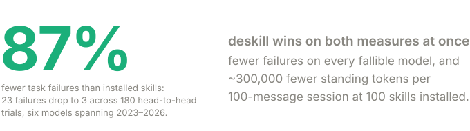
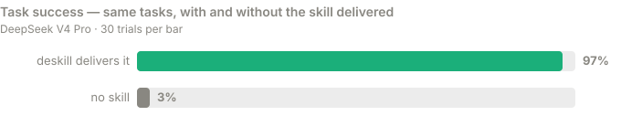
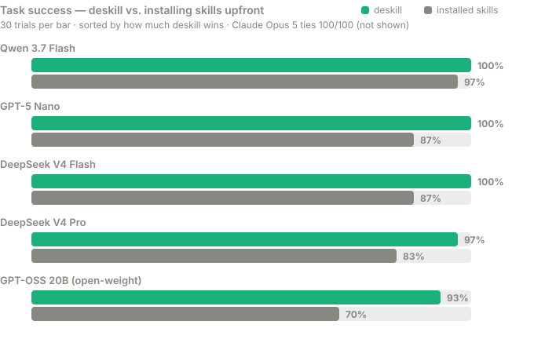

<p align="center">
  
</p>

<h1 align="center">deskill</h1>

<p align="center"><strong>Give your AI agent the right skill at the right moment — without stuffing its prompt.</strong></p>

<p align="center">
  <a href="#quick-tour">Install</a> ·
  <a href="#does-it-actually-matter-we-measured-it">Benchmarks</a> ·
  <a href="#what-installation-costs-you-in-tokens">Token savings</a> ·
  <a href="#why-people-use-it">Why?</a> ·
  <a href="#references">References</a>
</p>

Skills are little instruction packs that teach an agent how your team does things: how to write commits, review SQL, fill PDFs. Today the standard way to use them is to *install* them — every skill's description sits in your agent's prompt on every single message, forever. That costs tokens, clutters the context, and makes the agent guess which skill applies from a wall of text.

deskill does it the other way: **fetch the skill at the moment it's needed, straight from any GitHub repo, for zero standing cost.** One command to install, works with Claude Code, Cursor, and any MCP-compatible agent.

```sh
pip install deskill
claude mcp add deskill -- deskill-mcp
```

## Does it actually matter? We measured it.



Skills only work if they reach the model. Same tasks, same model — the only difference is whether deskill delivers the skill:



And *how* the skill gets there matters too. Installing skills upfront makes the model first spot the right one among 100 resident descriptions — small models drop real points at exactly that step. deskill hands over the skill next to the task and skips the guessing:



Selection is precise even when skills overlap: with every target installed beside two deliberately confusable siblings, models picked the **exact** right skill or stayed silent — zero wrong-sibling picks in 90 trials across three models. And in the head-to-head, **deskill never lost to installation on any model we compared, spanning 2023 to 2026** — frontier models (Claude Opus 5, not shown) simply tie at 100%, and the gap grows as models get smaller, reaching **23 points on a 20B open-weight model**. Every number comes from ~1,800 reproducible trials in this repo — run them yourself with `python -m evals.bench.runner exp1 --dry-run`, full write-up in `evals/`.

## What installation costs you in tokens

Installed skill descriptions ride in the prompt on **every message**, whether they're used or not. Rendered by deskill's own residency renderer and cross-checked against a real tokenizer (this bench uses lean ~30-token descriptions — real-world skills run 50–280 tokens each, so multiply accordingly):

| installed skills | every message pays | over a 100-message session |
|---|---|---|
| 10 | ~350 tokens | ~35,000 tokens |
| 25 | ~800 tokens | ~80,000 tokens |
| 50 | ~1,600 tokens | ~160,000 tokens |
| 100 | ~3,000 tokens | **~300,000 tokens** |
| **any number, via deskill** | **0 tokens** | **only what you actually use** |

A skill fetched by deskill costs its body once, at the moment it's used — typically a few hundred tokens — and nothing the rest of the session.

## Why people use it

- **Zero prompt bloat.** A hundred installed skills cost ~5–10k tokens on *every* message. A deskill reference costs nothing until the moment you use it.
- **Any skill on GitHub, by URL.** Paste a link, get the skill: `deskill get https://github.com/anthropics/skills/tree/main/skills/pdf`.
- **More reliable on cheaper models.** The smaller the model, the more the point-of-use delivery wins (measured above).
- **Keep what you like.** `deskill save` vendors a copy into your repo, git-tracked and yours to edit.
- **Still want a few skills always-on?** `deskill triggers add` keeps a short auto-fire list — install less, not nothing.

## Quick tour

```sh
deskill get gh:anthropics/skills/skills/pdf     # print a skill (or a menu for a collection)
deskill save gh:anthropics/skills/skills/pdf    # vendor a copy into .atskills/, yours to edit
deskill triggers add my-skill                   # keep a skill always-on
deskill prompt                                  # the always-on block, ready to paste
```

Or from any MCP client via JSON config:

```json
{ "mcpServers": { "deskill": { "command": "deskill-mcp" } } }
```

MCP tools: `deskill_get`, `deskill_menu`, `deskill_save`, `deskill_install`, `deskill_uninstall`, `deskill_prompt`.

Requires Python ≥ 3.11 and `git` on PATH — fetching rides plain git (shallow, sparse), so there's no API quota and private repos work with your existing credentials.

## Always-on skills (one-time setup)

If you keep a few skills always-on, their one-line descriptions need to live in your agent's prompt. deskill renders that block for you — paste it once:

```sh
deskill prompt >> CLAUDE.md
```

Or let Claude Code refresh it automatically each session (`.claude/settings.json`):

```json
{ "hooks": { "SessionStart": [{ "hooks": [{ "type": "command", "command": "deskill prompt" }] }] } }
```

## For the curious: conformance

deskill is a clean-room Python implementation of the @skills protocol — the full test suite mirrors the reference implementation's behaviors (addressing grammar, the 128-skill collection cap, local-first resolution through a validating cache, save/provenance rules, gitignore-style trigger files) and runs hermetically against local `file://` git remotes:

```sh
pip install -e .[dev]
python -m pytest tests/ -q
```

Not in v1: `hub:` registry resolution (the hub API hasn't shipped upstream), the interactive `/skills` TUI, and server-side trigger matching (it would deviate from the spec).

## References

- **The @skills protocol** — deskill implements the open protocol by SylphAI: spec at [SylphAI-Inc/atskills](https://github.com/SylphAI-Inc/atskills), introduced in *"@skills: Attention Is All You Have"* ([arXiv 2608.12610](https://arxiv.org/abs/2608.12610)). deskill is an independent second implementation.
- **The SKILL.md format** — the underlying skill file format is the open [Agent Skills](https://github.com/agentskills/agentskills) standard, originally developed by Anthropic.
- **Benchmark methodology & full results** — the complete write-up with every table, caveat, and measurement note: [`evals/FINDINGS.md`](evals/FINDINGS.md). Every number regenerates from the bench (see below); each trial lands as one JSONL row in `evals/results/`. Models tested: Claude Opus 5, GPT-5.6 Terra, GPT-5 Nano, GPT-OSS 20B, GPT-3.5 Turbo, Qwen 3.7 Flash, DeepSeek V4 Pro & Flash.

## Run the evals yourself

```sh
pip install -e .[bench]
python -m evals.bench.runner exp1 --dry-run     # preview exactly what will be sent
python -m evals.bench.runner exp1 --yes         # trigger reliability vs. installed count
python -m evals.bench.runner exp2 --yes         # installed vs. deskill, task success
python -m evals.bench.runner exp3 --yes         # does distance in context hurt?
python -m evals.bench.runner exp4 --yes         # with-skill vs. no-skill delta
python -m evals.bench.runner exp5 --yes         # exact selection with overlapping skills
python -m evals.bench.analyze evals/results/*.jsonl
```

Runs on your Claude Code subscription (no API key needed), the Anthropic API, or any OpenRouter model (`--backend openrouter --model <id>`). Seed-pinned, resumable, one JSONL row per trial; results land in `evals/results/`.

## License

MIT
